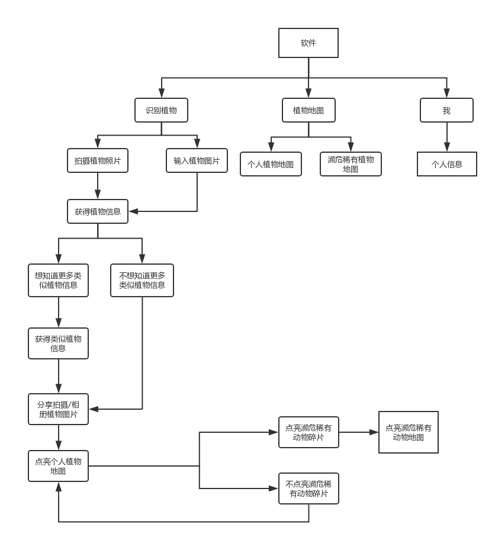

# API_ML_AI 植物识别之“植物地图”
Final project product requirements

|         |            |
| ------------- |:-------------:|
| Target release     | 未定 |
| Epic      |  植物识别之“植物地图”   |
| Document status | 已开始      |
| Designer        | 靳诗雅 |
| Developer       | 靳诗雅 |
| QA | 靳诗雅  |

## Goals
* 随时随地，拿起手机或平板设备拍照，满足用户想要知道植物名称、鲜花花语名字的好奇心，让你轻松变身植物专家。
* 并通过查询得到的结果，能“知道更多”，在识别眼前植物的同时，并将获得植物的详细信息.
* 并让用户可以分享所见植物，通过打卡最终形成个人植物地图
* 增加濒临灭绝植物小知识,让大家关注稀有植物

## Background and strategic fit
* 当我们从别处听到好听的音乐但不知道歌名时，我们会用音乐播放器等 APP 把歌名给识别出来，补充了许多遗憾，听到更多喜欢的音乐。而远足看风景或从一盆盆栽中偶遇美丽的植物、花朵，却不知道那到底是什么植物、什么花，有什么特质跟花语，也实在是件令人遗憾的事情。所以通过植物识别产品可以满足用户的好奇心，让你轻松变身植物专家. 
* 植物研究者称，物种的绝灭和新物种的形成是一个自然的演化过程，由于地球环境的变迁，一些物种无法适应新的环境而灭绝，同时形成一些适应新环境的新物种。植物的生存作为生物多样性、生态系统中不可或缺的环节，却一直受制于内忧外患的压力。无声无息中，大批植物正走向濒危的状态。植物濒危的原因非常复杂，其人类的不当活动以及气候变化和外来入侵物种的蔓延等外部因素却是植物物种走向濒危之路的主要原因。
* 中国地域辽阔，植物资源丰富，但近30年来，由于经济快速发展、人口迅速增长、环境破坏严重，植被萎缩等压力，中国现有野生植物物种中约有6000种植物处于濒危或濒临绝灭的状况，并且已有100多种植物面临极危或濒危，有相当大一部分的种质资源在野外已经不存在。我国生物物种数量正在以每天一个濒危甚至濒临灭绝的速度减少。由于物种之间的相互依存，相互制约的关系，1个物种的消失，常常可导致另外10-30种生物的生存危机，由此可能最终导致整个生态系统的崩解。我国正处在濒临物种灭绝危机的边缘，每年都有越来越多的植物物种灭绝。物种濒危及濒临绝灭的速度和数量，让不少科研人员充满忧慌。

## 加值宣言
通过调用阿里云花伴侣智能植物识别API，将拍摄或上传的植物图片识别出来，以文字形式展示植物信息，增加用户植物方面知识，然后通过将见到的植物分享出去（植物拍摄定位、植物图片）形成个人植物地图。除此之外还增加了推荐濒危植物知识的功能，呼吁用户认识并保护濒危植物。

## 核心价值
Questions|Qutcome
-|-
提供经过“阿里云花伴侣智能植物识别API”识别用户拍摄或上传的植物图片|帮助读者用户更好获取评论内容
使用语音合成,播放用户感兴趣的植物信息播放|解决用户在欣赏花草行进过程中情景中无法同时植物信息与其他植物的问题
使用高德地图API形成用户个人植物地图|记录用户识别植物的轨迹
使用推荐系统推荐濒危植物知识信息|呼吁用户保护濒危植物

##  Assumptions
* 用户使用该产品时，主要是在手机或者平板设备的环境下，会通过拍照记录想知道信息的植物.  
* 用户上传的植物图片，可能会含有多种植物.  
* 主要是针对图片中最突出的植物品种作为识别，并介绍该植物的名称、属性等信息.（如植物识别玫瑰，则介绍玫瑰花语、玫瑰种植需知等）
* 见到喜欢的植物想要分享出去，通过打开不同地方不同植物的分享，形成自己的植物地图，从此获得满足和成就感.

## User Usage Scenarios

|         |    Title     |       User story     |      Importance     |      Notes     |
| ------------- |:-------------:|:-------------:|:-------------:|:-------------:|
| 1.看到好奇植物时        |   输出植物名称后，想知道植物植物信息    | 需要点击知道更多 | Must Have |  |  
| 2.得到植物信息之后        |   输出植物图片后，想分享出去从而打卡形成植物地图    | 需要点击分享 | Must Have |  |  
| 3.分享植物图片后        |   每分享一次将（通过推荐）获得一个濒临灭绝植物/稀有植物的碎片,点亮并获取其信息    | 需要点击收集 | Must Have |  |  

## 用户研究 

* 用户目标：通过拍摄一种植物图片可获得此类似植物的信息，发现世界之美，分享所见植物，打卡不同地方的不同植物，形成个人植物地图，通过每分享一次将（通过推荐）获得一个濒临灭绝植物/稀有植物的碎片,点亮碎片并获取其信息。

* 用户心理需求：

|    Question     |       Answer     |
| ------------- |:-------------:|
|   为什么用户要使用这个软件？      |   用户想知道眼前的植物叫什么   |  
|   为什么用户想知道眼前的植物叫什么？      |   用户想要拥有植物方面的知识，满足自身好奇心   | 
|   什么样的人会使用这个软件？      |   对植物好奇的人/什么都想知道的小孩子/植物爱好者   | 
|   用户会在什么情况下使用这个软件？      |   在眼前出现奇特植物时/好奇心泛滥时/对植物知识有需求时   |  
|   为什么用户想要打卡植物形成个人植物地图？      |   因为在好奇心的满足下拥有征服感   |  
|   用户分享植物图片时会想要如何分享？      |   分享植物的图片/植物地点/看到植物的心情   |  
|   用户分享后为什么想要点亮碎片？      |   满足好奇心和成就感   | 

* 解决痛点
1. 让人可以随时随地知道身边的植物信息
2. 满足人们想要知道植物名称、鲜花花语名字的好奇心，让你轻松变身植物专家
3. 引起对濒危/稀有植物的关注

## User intercaion and design

### 表现分析
#### 输入:
* 拍摄植物
* 植物的照片
* 植物名称

#### 输出:
* 植物相关信息
* 分享形成个人植物地图
* 濒临灭绝/稀有植物信息知识推荐 [中国珍惜濒危植物信息系统](http://rep.iplant.cn/)

### 产品流程图 Flows

### 异常流程 Exception Flows
* 用户阅读识别植物信息后不会点击知道更多
* 用户并没有分享所拍摄植物图片，无法提供拍摄照片定位
* 分享之后不领取点亮的濒危/稀有植物碎片

### 产品框架图

### 交互需求 Interaction requirements
* 扫描植物需要有直接并且明显的入口
* 用户阅读植物信息的界面设计需要简单
* 分享植物的页面需要简洁（植物定位、植物图片、心情分享）
* 推荐的濒临灭绝/稀有植物的信息需要吸引用户眼球，让用户有想点进去的冲动，推荐弹框可以更为简洁或可爱

### 产品原型  

### Questions

|    Question     |       Outcome     |   
| ------------- |:-------------:|
|   如何实现输出植物结果与地图的联系？      |   需要使用高德地图api   |  
|   如何精确识别植物的品种      |   需要百度植物识别api与阿里花伴侣智能植物识别api   | 
|   如何收集濒危植物/稀有植物的信息      |   暂时Not doing 尝试通过[中国珍惜濒危植物信息系统](http://rep.iplant.cn/)收集信息  | 
|   如何实现推荐濒危植物知识      |   暂时Not doing   | 

## Nurture plan
### 前期
- 通过广告宣传、用户体验使用调查研究形成一定的用户规模
- 通过分享拍摄植物图片集赞赢大礼等方式,拉拢稳固平台用户
- 给予拍摄植物、获得植物小知识打卡方式赢得奖励,让用户分享软件来推广

### 中期
- 收集到大量数据之后,开启植物聚集地,让用户保持对植物的好奇心
- 聚集不同的植物爱好者，从个人植物地图形成植物聚集植物地图，分享不同地区的不同植物，发现植物的不同世界。

### 后期
- 在打卡分享的过程中将植物知识普及大家，让大家不会忽略城市之中的一点点绿色和一点点美丽的色彩！

## Testing plan
从个人植物地图形成植物聚集大地图，用植物地图将不同地区的不同植物爱好者连接起来，为各位好奇猫提供好奇心解决平台，保持好奇，探究植物！

## 产品详情介绍

### APP效果图  
* [原型效果链接](https://gwengaa.github.io/prototype/)

### 功能
* 识别拍摄的植物图片
* 介绍植物详细信息，通过语音合成来播放植物信息  
* 通过分享拍摄的植物图片进行打卡从而形成个人的植物地图
* 推荐濒临灭绝/稀有植物信息

### 调用的API
* 百度细粒度图像识别—植物识别API  
* 阿里云花伴侣智能植物识别API
* 高德地图API（Not doing）

### 代码展示
* [原代码链接](https://github.com/Gwengaa/API_ML_AI/blob/master/%E7%99%BE%E5%BA%A6%E6%A4%8D%E7%89%A9%E8%AF%86%E5%88%AB.ipynb)

* 百度api 

* 阿里api

* 阿里api（杂草类）

### API调用比较

* 百度api准确度 

* 阿里api准确度

* 百度api价格

* 阿里api价格

* 对比分析

|         |       百度植物识别api     |       阿里智能植物识别api     |      
| ------------- |:-------------:|:-------------:|
|   准确度      |      |   ✔   |    
|   价格      |   ✔   |       |

* 使用后风险报告
  - 通过测试阿里智能植物识别api的准确率达到%94.15，百度植物识别api准确率达到%85.33；百度植物识别api每日有500次免费调用量，用完后调用将以0.003元一次收费，阿里智能植物识别api注册后有500次免费调用量，用完后调用将以0.1元一次收费；
  - 通过测试阿里智能识别api更精准，价格更高；百度植物识别api精准度一般，价格实惠。
  - 由于识别的精准度对于本产品有影响，故在综合评估下将选择阿里花伴侣智能植物识别api；若精准度对本产品无影响将会选择价格更实惠的百度植物识别api    

* 人工智能概率性
用户上传的植物图片，可能会含有多种植物，并且可能会由于泛化能力弱或者图片不清晰，导致植物检测出现错误。但我们主要是针对图片中最突出的植物品种作为识别，我尝试上传了一张杂草的照片，其中狗尾巴草最为明显，阿里智能植物识别api可识别出狗尾巴草准确度为%98.94

### 已实现的功能  
* 可拍照识别植物  
* 可查看相关植物信息
* 分享所拍摄的植物图片

### 待解决
* 推荐濒危植物知识    
* 高德地图api调用形成个人植物地图
* 高德地图定位图标转换为图片
