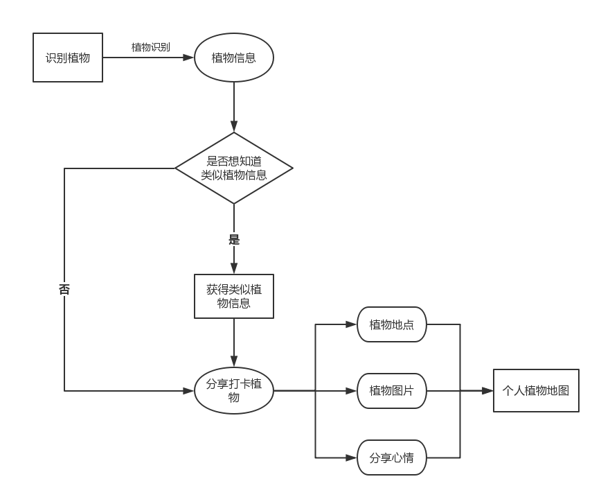

# API_ML_AI 植物识别之个人“植物地图”
Final project product requirements

|         |            |
| ------------- |:-------------:|
| Target release     | 未定 |
| Epic      |  植物识别之“植物地图”   |
| Document status | 已开始      |
| Designer        | 靳诗雅 |
| Developer       | 靳诗雅 |
| QA | 靳诗雅  |

## Goals
* 随时随地，拿起手机，满足用户想要知道植物名称、鲜花花语名字的好奇心，让你轻松变身植物专家。
* 并通过查询得到的结果，能“知道更多”，在识别眼前植物的同时，并将获得类似植物的推荐信息.
* 并让用户可以分享所见植物，最终形成个人植物地图
* 增加濒临灭绝植物小知识,让大家关注稀有植物

## Background and strategic fit
* 当我们从别处听到好听的音乐但不知道歌名时，我们会用音乐播放器等 APP 把歌名给识别出来，补充了许多遗憾，听到更多喜欢的音乐。而远足看风景或从一盆盆栽中偶遇美丽的植物、花朵，却不知道那到底是什么植物、什么花，有什么特质跟花语，也实在是件令人遗憾的事情。所以通过植物识别可以满足用户的好奇心，让你轻松变身植物专家.  
* 产品使用图像识别，用拍照就能检测出植物的品种，并了解到植物的信息.  
* 如果用户对此类植物感兴趣，可以点击“知道更多”来获取相关类似植物的介绍.
* 除此之外，通过将见到的植物分享出去（植物定位、植物图片）形成个人植物地图.

## Assumptions
* 用户使用该产品时，主要是在手机的环境下，会通过拍照记录想知道信息的植物.  
* 用户上传的植物图片，可能会含有多种植物.  
* 可能会由于泛化能力弱，导致植物检测出现错误.  
* 主要是针对图片中最突出的植物品种作为识别，并介绍该植物的名称、属性等信息.（如植物识别玫瑰，则介绍玫瑰花语、玫瑰种植需知等，并且可以推荐白玫瑰、蓝玫瑰等类似植物信息）
* 见到喜欢的植物想要分享出去，通过打开不同地方不同植物的分享，形成自己的植物地图.

## User intercaion and design

### 表现分析
#### 输入:
* 拍摄植物
* 植物的照片
* 植物名称

#### 输出:
* 植物相关信息
* 类似植物推荐
* 分享形成个人植物地图
* 濒临灭绝/稀有植物信息知识推荐

### 产品流程图 Flows

### 异常流程 Exception Flows
* 用户阅读识别植物信息后不会点击相关植物推荐
* 用户并没有分享所拍摄植物图片，无法提供拍摄照片定位

### 产品框架图

### User artefacts
* 用户目标：通过拍摄一种植物图片可获得此类似植物的信息，举一反三，获取更多植物知识，发现世界之美，分享所见植物，打卡不同地方的不同植物，形成个人植物地图
* 5why：

|    Question     |       Answer     |
| ------------- |:-------------:|
|   为什么用户要使用这个软件？      |   用户想知道眼前的植物叫什么   |  
|   为什么用户想知道眼前的植物叫什么？      |   用户想要拥有植物方面的知识，满足自身好奇心   | 
|   什么样的人会使用这个软件？      |   对植物好奇的人/什么都想知道的小孩子/植物爱好者   | 
|   用户会在什么情况下使用这个软件？      |   在眼前出现奇特植物时/好奇心泛滥时/对植物知识有需求时   |  
|   为什么用户想要打卡植物形成个人植物地图？      |   因为在好奇心的满足下拥有征服感   |  
|   用户分享植物图片时会想要如何分享？      |   分享植物的图片/植物地点/看到植物的心情   |  

## Interaction requirements
* 扫描植物需要有直接并且明显的入口
* 用户阅读植物信息的界面设计需要简单
* 推荐相关类似植物的页面需要轻快，不要弹出霸占整个屏幕，不要给予用户有阅读压力
* 分享植物的页面需要简洁（植物定位、植物图片、心情分享）

## Requirements

|         |    Title     |       User story     |      Importance     |      Notes     |
| ------------- |:-------------:|:-------------:|:-------------:|:-------------:|
| 1        |   输出植物名称后，想知道类似植物植物信息    | 需要点击知道更多 | Must Have |  |  
| 2        |   输出植物图片后，想分享出去从而打卡形成植物地图    | 需要点击分享 | Must Have |  |  
| 3        |   每分享一次将点亮一个濒临灭绝植物/稀有植物的卡片,并获取其信息    | 需要点击查看 | Must Have |  |  

## User interaction and design  

## Questions

|    Question     |       Outcome     |   
| ------------- |:-------------:|
|   如何实现输出植物结果与地图的联系？      |   需要使用高德地图api   |  
|   如何精确识别植物的品种      |   需要百度植物识别api与阿里花伴侣智能植物识别api   | 
|   如何收集濒临灭绝植物/稀有植物的信息      |   暂时Not doing   | 
|   如何实现识别植物的类似植物推荐      |   暂时Not doing   | 

## Not doing
* 推荐系统：推荐与识别植物类似的植物

## Nurture plan
### 前期
- 通过广告宣传、用户体验使用调查研究形成一定的用户规模
- 通过分享拍摄植物图片集赞赢大礼等方式,拉拢稳固平台用户
- 给予拍摄植物、获得植物小知识打卡方式赢得奖励,让用户分享软件来推广

### 中期
- 收集到大量数据之后,开启植物聚集地,让用户保持对植物的好奇心
- 聚集不同的植物爱好者，从个人植物地图形成植物聚集植物地图，分享不同地区的不同植物，发现植物的不同世界。

### 后期
- 在打卡分享的过程中将植物知识普及大家，让大家不会忽略城市之中的一点点绿色和一点点美丽的色彩！

## Testing plan
从个人植物地图形成植物聚集大地图，用植物地图将不同地区的不同植物爱好者连接起来，为各位好奇猫提供好奇心解决平台，保持好奇，探究植物！

### APP效果图  
* [原型效果链接](https://gwengaa.github.io/prototype/)

### 功能
* 识别拍摄的植物图片
* 介绍相关植物的信息（分享附近的人的识图环境，可以快速发现周边花卉，欣赏植物景点）  
* 可推荐相关植物信息（如植物识别为红玫瑰，则推荐其他白玫瑰、粉玫瑰、蓝玫瑰的信息）
* 通过分享拍摄的植物图片进行打卡从而形成个人的植物地图

### 调用的API
* 百度细粒度图像识别—植物识别API  
* 阿里云花伴侣智能植物识别API
* 高德地图API

### 代码展示
* [原代码链接](https://github.com/Gwengaa/API_ML_AI/blob/master/%E7%99%BE%E5%BA%A6%E6%A4%8D%E7%89%A9%E8%AF%86%E5%88%AB.ipynb)

* 百度ap

* 阿里api

* 阿里api（杂草类）

### API调用比较

* 百度api准确度 

* 百度api价格

* 阿里api准确度

* 阿里api价格

|         |       百度植物识别api     |       阿里花伴侣智能植物识别api     |      
| ------------- |:-------------:|:-------------:|
|   准确度      |      |   ✔   |    
|   价格      |   ✔   |       |
|   备注      |   由于识别的精准度对于本产品有影响，故在综合评估下将选择阿里花伴侣智能植物识别api；若精准度对本产品无影响将会选择价格更实惠的百度植物识别api        |

### 已实现的功能  
* 可拍照识别植物  
* 可查看相关植物信息
* 分享所拍摄的植物图片

### 待解决
* 植物和相关植物推荐不能实现联动    
